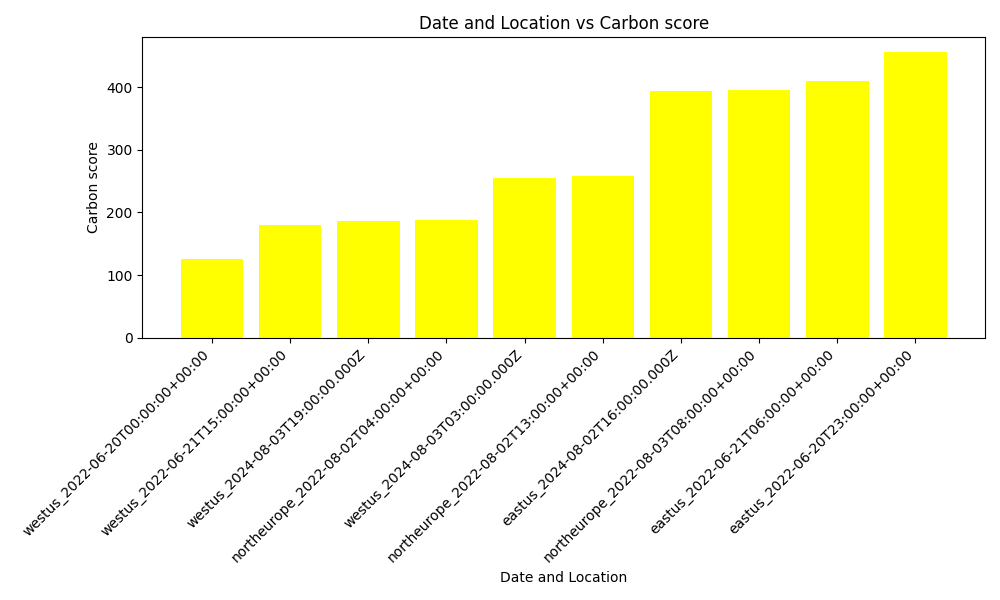

# CarbonAwareAdvisor Model

## Overview
The CarbonAwareAdvisor model is designed to provide carbon emission data based on specified locations and timeframes. It interacts with the Carbon Aware SDK to fetch the most carbon-efficient options for given parameters.

## Key Features
- **Location Filtering**: Users can specify a list of locations to consider for carbon emission data.
- **Timeframe Filtering**: Users can define time ranges to narrow down the search for carbon emission data.
- **Sampling**: An optional parameter that allows users to specify the number of data points to sample from the available data, providing a broader view of the carbon emission landscape. If sampling is not defined in the impl then no data points are sampled and the plotted-points is not added in the ompl.

## Outputs
- ** Suggestions: **: List of the best location and time combination to minimize the carbon score along with that score.
- ** Plotted-points: **: ONLY IF THE SAMPLING PARAMETER IS INITIALIZED IN THE IMPL. A sampling number of samples for trade-off visualization. A best combination from each timeframe is always included . So sampling must be >= number of time regions in the allowed-timeframes. The plotter model can then be used in the pipeline to plot this samples.

## Prerequisites
- The Carbon Aware Web API must be running locally (default: `http://localhost:5073`).
- Ensure `axios` and `qs` libraries are installed in your environment.

## Instructions to get Carbon Aware Web API running locally
Please refer to this for more information, but there are too many errors in this document! [Carbon Aware SDK Docs](https://github.com/Green-Software-Foundation/carbon-aware-sdk/tree/dev/docs)

  Prerequisites:

- .NET Core 6.0
- Alternatively:
  - Docker
  - VSCode (it is recommended to work in a Dev Container)
  - Remote Containers extension for VSCode:
    <https://marketplace.visualstudio.com/items?itemName=ms-vscode-remote.remote-containers>


1. git clone https://github.com/Green-Software-Foundation/carbon-aware-sdk.git
2. Open VSCode Command Palette: (Linux/Windows: `ctrl + shift + P`, MacOS: `cmd + shift + P`), and run the command: `Dev Containers: Open Folder in Container` to open carbon-aware-sdk folder you just cloned (Starting Dev Container for the first time will take a while)
3. Change directory to: `cd src/CarbonAware.WebApi/src`
4. Replace the appsettings.json file with the following
```
{
  "LocationDataSourcesConfiguration": {
    "LocationSourceFiles": [
      {
        "DataFileLocation": "azure-regions.json"
      },
      {
        "DataFileLocation": "custom-azure-zones.json",
        "Prefix": "zone",
        "Delimiter": "."
      }
    ]
  },
  "DataSources": {
    "EmissionsDataSource": "ElectricityMaps",
    "ForecastDataSource": "ElectricityMaps",
    "Configurations": {
      "test-json": {
        "Type": "JSON",
        "DataFileLocation": "test-data-azure-emissions.json"
      },
      "ElectricityMaps": {
        "Type": "ElectricityMaps",
        "APITokenHeader": "auth-token",
        "APIToken": "jDLmBL4tkhr4LDrzuUj3i96077Ozj3g1",
        "BaseURL": "https://api-access.electricitymaps.com/2w97h07rvxvuaa1g/"
      }
    }
  }
}
```
5. Run in Terminal: `dotnet run` in the 'src/CarbonAware.WebApi/src' directory, default running at 127.0.0.1:5073


## Configuration
The model requires two main parameters to be configured in the impl file:
- `allowed-locations`: A list of locations for which the carbon data is required.
The locations can also be keywords like azure_europe etc that are sets of locations that cover a wider range so that the user does not have to write each individual location. You can find all the available keywords and locations at the locations.json .
- `allowed-timeframes`: A list of timeframes in the format `YYYY-MM-DDTHH:MM:SSZ - YYYY-MM-DDTHH:MM:SSZ`.
The timeframes can be in the past and up to 5 years in the future. If the timeframe is in the future then we perform our own forecasting algorithm.
Optional parameter:
- `sampling`: Specifies the number of data points to sample from the returned data for a more granular analysis. If it is not specified then only the best timeframe and location combination is returned. Sampling if specified must be larger or equal to the number of allowed timeframes. The sampling emmission data are sampled uniformely from the allowed-timeframes (more data will be returned from larger timeframes) and the best emission data for each timeframe is always returned. The rest from that timeframe are selected at random.

## Example Impl Configuration without sampling
Impl:

```yaml
name: Carbon Advisor Demo
description: Simple demo for invoking carbon-advisor model
tags: null
initialize:
  plugins:
    carbon-aware-advisor:
      path: '@grnsft/if-optimisation-models'
      method: CarbonAwareAdvisor
      global-config:
        allowed-locations:
          - northeurope
          - eastus
        allowed-timeframes:
          - 2022-06-19T14:00:00Z - 2022-06-21T19:00:00Z
          - 2024-08-01T19:00:00Z - 2024-08-03T20:35:31Z
  outputs:
    - yaml
if-version: v0.3.1
tree:
  children:
    child0:
      pipeline:
        - carbon-aware-advisor
      inputs:
        - null
```
Ompl: 

```yaml
name: Carbon Advisor Demo
description: Simple demo for invoking carbon-advisor model
tags: null
initialize:
  plugins:
    carbon-aware-advisor:
      path: '@grnsft/if-optimisation-models'
      method: CarbonAwareAdvisor
      global-config:
        allowed-locations:
          - northeurope
          - eastus
        allowed-timeframes:
          - 2022-06-19T14:00:00Z - 2022-06-21T19:00:00Z
          - 2024-08-01T19:00:00Z - 2024-08-03T20:35:31Z
  outputs:
    - yaml
if-version: v0.3.1
tree:
  children:
    child0:
      pipeline:
        - carbon-aware-advisor
      inputs:
        - null
      outputs:
        - suggestions:
            - location: northeurope
              time: '2024-08-03T17:00:00.000Z'
              rating: 256.0375
              duration: '01:00:00'
```

## Example configuration with sampling and plotter model to visualize the data
Impl:
```yaml
name: Carbon Advisor Demo
description: Simple demo for invoking carbon-advisor model
tags: null
initialize:
  plugins:
    carbon-aware-advisor:
      path: '@grnsft/if-optimisation-models'
      method: CarbonAwareAdvisor
      global-config:
        allowed-locations:
          - northeurope
          - eastus
          - westus
        allowed-timeframes:
          - 2022-06-19T14:00:00Z - 2022-06-21T19:00:00Z
          - 2022-08-01T19:00:00Z - 2022-08-03T20:35:31Z
          - 2024-08-01T19:00:00Z - 2024-08-03T20:35:31Z
        sampling: 10
    plotter:
      path: '@grnsft/if-plugins'
      method: Shell
      global-config:
        command: python3 ./src/lib/plotter/plotter
  outputs:
    - yaml
if-version: v0.3.1
tree:
  children:
    child0:
      pipeline:
        - carbon-aware-advisor
        - plotter
      defaults:
        x-name:
          - location
          - time
        y-name: rating
        colour: yellow
        diagram-name: diagrams/New_carbon4
        x-axis-name: Date and Location
        y-axis-name: Carbon score
        diagram-title: Carbon score in relation to time and location (ascending)
        graph-type: bar
      inputs:
        - input1: input1
```
Ompl:
```yaml
name: Carbon Advisor Demo
description: Simple demo for invoking carbon-advisor model
tags: null
initialize:
  plugins:
    carbon-aware-advisor:
      path: '@grnsft/if-optimisation-models'
      method: CarbonAwareAdvisor
      global-config:
        allowed-locations:
          - northeurope
          - eastus
          - westus
        allowed-timeframes:
          - 2022-06-19T14:00:00Z - 2022-06-21T19:00:00Z
          - 2022-08-01T19:00:00Z - 2022-08-03T20:35:31Z
          - 2024-08-01T19:00:00Z - 2024-08-03T20:35:31Z
        sampling: 10
    plotter:
      path: '@grnsft/if-plugins'
      method: Shell
      global-config:
        command: python3 ./src/lib/plotter/plotter
  outputs:
    - yaml
if-version: v0.3.1
tree:
  children:
    child0:
      pipeline:
        - carbon-aware-advisor
        - plotter
      defaults:
        x-name:
          - location
          - time
        y-name: rating
        colour: yellow
        diagram-name: diagrams/New_carbon4
        x-axis-name: Date and Location
        y-axis-name: Carbon score
        diagram-title: Carbon score in relation to time and location (ascending)
        graph-type: bar
      inputs:
        - input1: input1
      outputs:
        - input1: input1
          x-name:
            - location
            - time
          y-name: rating
          colour: yellow
          diagram-name: diagrams/New_carbon4
          x-axis-name: Date and Location
          y-axis-name: Carbon score
          diagram-title: Carbon score in relation to time and location (ascending)
          graph-type: bar
          suggestions:
            - location: westus
              time: '2022-06-20T00:00:00+00:00'
              rating: 126
              duration: '01:00:00'
          plotted-points:
            - location: westus
              time: '2022-06-20T00:00:00+00:00'
              rating: 126
              duration: '01:00:00'
            - location: westus
              time: '2022-06-21T15:00:00+00:00'
              rating: 180
              duration: '01:00:00'
            - location: eastus
              time: '2022-06-21T06:00:00+00:00'
              rating: 410
              duration: '01:00:00'
            - location: eastus
              time: '2022-06-20T23:00:00+00:00'
              rating: 457
              duration: '01:00:00'
            - location: northeurope
              time: '2022-08-02T04:00:00+00:00'
              rating: 188
              duration: '01:00:00'
            - location: northeurope
              time: '2022-08-03T08:00:00+00:00'
              rating: 395
              duration: '01:00:00'
            - location: northeurope
              time: '2022-08-02T13:00:00+00:00'
              rating: 259
              duration: '01:00:00'
            - location: westus
              time: '2024-08-03T19:00:00.000Z'
              rating: 186.68333333333334
              duration: '01:00:00'
            - location: eastus
              time: '2024-08-02T16:00:00.000Z'
              rating: 393.48125
              duration: '01:00:00'
            - location: westus
              time: '2024-08-03T03:00:00.000Z'
              rating: 255.68333333333334
              duration: '01:00:00'
          diagram: >-
            /home/jim/comp0101-ief/Code/if-optimisation-models/diagrams/New_carbon4.png

```
And we can see the following diagram being created:


## Usage
1. Define the required configuration in an impl file as shown in the example above.
2. Invoke the CarbonAwareAdvisor model within your pipeline.
3. Optionally, add the `plotter` model to visualize the carbon emission data.


## Forecasting
For a number of timeframe ranges that are either very recent or in the future the Carbon Aware SDK Api will not return any values. So we have created a prediction mechanism to provide with a forecast for that timeframe range using past values. This is a simple approach and by no means offers high accuracy. But it is a first implementation that can be expanded in the future to offer better predictions. The carbon Aware SDK might also be improved in future versions to perform future predictions for a longer time.

The way the current algorith works is that the carbon of an unavaliable timeframe is measured as the weighted average of the average carbon score for that location the last X number of days.(X is currently defined as 10) and the score for that datetime and location the last available year. The weights are 0.5 for the average and 0.5 for the last available year, as our analysis showed these produced the best results, but the user is free to change those values at the beggining of the index.ts file as they see fit.

## Integrating with Plotter
To visualize the carbon emission data, integrate the `CarbonAwareAdvisor` model with the `plotter` model in your pipeline. Provide the necessary configurations for both models as per your requirements. The plotter model will automatically go through the plotted-points to search for the data so the x_name should be defined as [location, time] and the y_name as score.

## Contributing
Contributions to the CarbonAwareAdvisor model are welcome. Please submit pull requests with any enhancements, bug fixes, or additional features you'd like to add.


