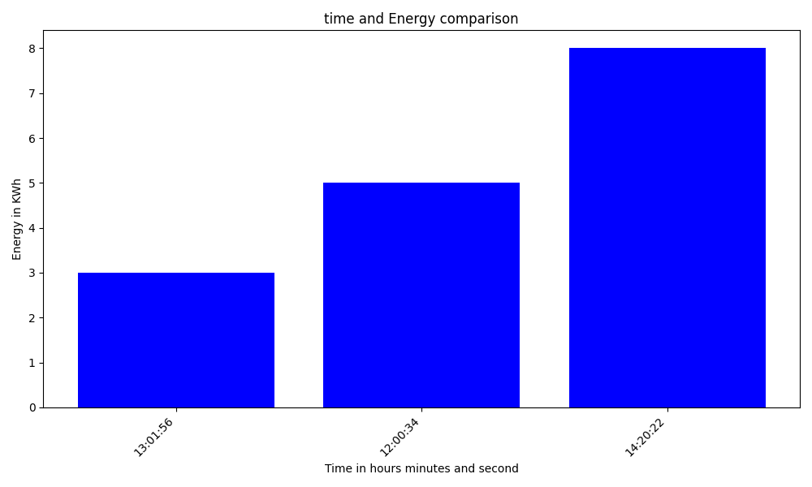
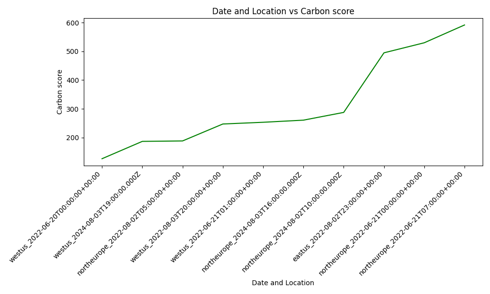
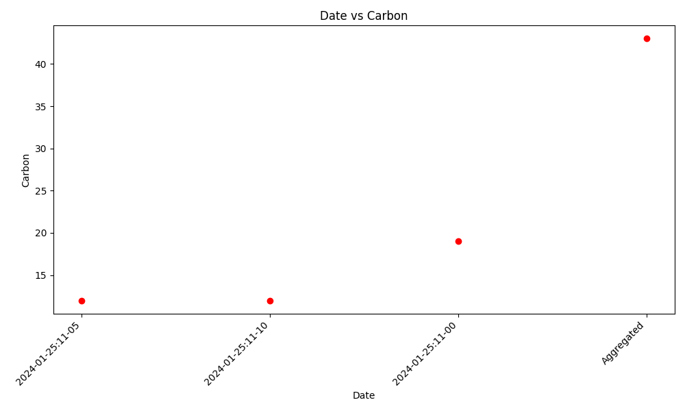

# Plotter Model

## Overview
The Plotter model created for the Impact Engine Framework is designed to visualize data through various types of graphs such as bar, line, and scatter plots. It takes input in YAML format or csv format , defining the x and y values along with additional parameters to customize the plots.


## Usage
This model is typically used in a pipeline following data-enrichment models like `carbon-advisor`, which populates the `plotted-points` parameter required by Plotter. If the user prefers he can specify the `plotted-points` parameter himself in the Impl file but the main value of the model is its ability to visualize the data provided by other models of the Impact Engine Framework. The user can also specify a csv file to read the data to plot from.

## Configuration
There are three different ways to get the data to plot from :
- The Impl file itself
- Previous models in the pipeline
- A csv file

For each of the 3 different ways a different set of parameters is required.

- Reading from Impl:
  Required parameters include:
  - `plotted-values`: The data points to plot, enriched by preceding models in the pipeline.
  - `x-name`: Array of one or more attributes from `plotted-values` to form the 'x-axis'.
  - `y-name`: A single attribute from `plotted-values` for the 'y_axis'.

- Getting the data from previous models in the pipeline:
  Required parameters include:
  - `x-name`: Array of one or more attributes from `plotted-values` to form the 'x-axis'.
  - `y-name`: A single attribute from `plotted-values` for the 'y_axis'.

- Reading from csv file:
  Required parameters include:
  - `csv-path` :path to the csv file to read from
  - `y-name`: A single row name for the csv file for the 'y_axis'.

Optional parameters with defaults:
- `colour`: Default is `light-blue`.
- `diagram-name`: Defaults to `combinations-diagram.png`.
- `x-axis-name`, `y-axis-name`: Axis labels, auto-generated if not provided. Default 'x-axis-name' is the 'x-name' attributes concatenated with underscore. Default 'y-axis-name' is the 'y-name' attribute.
- `diagram-title`: Auto-generated if not provided. Default diagram-title is  'x-axis-name' vs 'y-axis-name'.
- `graph-type`: Can be `bar`, `line`, or `scatter`. Default is `bar`.

## Type 1 : Read the data from the Impl file 
## Simple Example Impl and corresponding Ompl
Impl:
```yaml
name: Plotter_demo
description: example impl invoking plotter model
tags: null
initialize:
  plugins:
    plotter:
      path: '@grnsft/if-plugins'
      method: Shell
      global-config:
        command: python3 ./src/lib/plotter/plotter
  outputs:
    - yaml
if-version: v0.3.1
tree:
  children:
    child0:
      defaults:
        x-name:
          - time
        y-name: energy
        colour: blue
        diagram-name: diagrams/New_visualizer1
        x-axis-name: Time in hours minutes and second
        y-axis-name: Energy in KWh
        diagram-title: time and Energy comparison
        graph-type: bar
      pipeline:
        - plotter
      inputs:
        - plotted-points:
            - time: '12:00:34'
              energy: 5
            - time: '13:01:56'
              energy: 3
            - time: '14:20:22'
              energy: 8
```
Ompl:
```yaml
name: Plotter_demo
description: example impl invoking plotter model
tags: null
initialize:
  plugins:
    plotter:
      path: '@grnsft/if-plugins'
      method: Shell
      global-config:
        command: python3 ./src/lib/plotter/plotter
  outputs:
    - yaml
if-version: v0.3.1
tree:
  children:
    child0:
      defaults:
        x-name:
          - time
        y-name: energy
        colour: blue
        diagram-name: diagrams/New_visualizer1
        x-axis-name: Time in hours minutes and second
        y-axis-name: Energy in KWh
        diagram-title: time and Energy comparison
        graph-type: bar
      pipeline:
        - plotter
      inputs:
        - plotted-points:
            - time: '12:00:34'
              energy: 5
            - time: '13:01:56'
              energy: 3
            - time: '14:20:22'
              energy: 8
      outputs:
        - plotted-points:
            - time: '12:00:34'
              energy: 5
            - time: '13:01:56'
              energy: 3
            - time: '14:20:22'
              energy: 8
          x-name:
            - time
          y-name: energy
          colour: blue
          diagram-name: diagrams/New_visualizer1
          x-axis-name: Time in hours minutes and second
          y-axis-name: Energy in KWh
          diagram-title: time and Energy comparison
          graph-type: bar
          diagram: >-
            /home/jim/comp0101-ief/Code/if-optimisation-models/diagrams/New_visualizer1.png

```
And we can see the following diagram being created:

## Type 2 : Get data from previous models in the pipeline
## Example Pipeline with carbon-advisor for plotted points

Impl:
```yaml
name: Carbon Advisor Demo with plotter
description: Simple demo for invoking carbon-advisor model and the plotter
tags: null
initialize:
  plugins:
    carbon-aware-advisor:
      path: '@grnsft/if-optimisation-models'
      method: CarbonAwareAdvisor
      global-config:
        allowed-locations:
          - northeurope
          - eastus
          - westus
        allowed-timeframes:
          - 2022-06-19T14:00:00Z - 2022-06-21T19:00:00Z
          - 2022-08-01T19:00:00Z - 2022-08-03T20:35:31Z
          - 2024-08-01T19:00:00Z - 2024-08-03T20:35:31Z
        sampling: 10
    plotter:
      path: '@grnsft/if-plugins'
      method: Shell
      global-config:
        command: python3 ./src/lib/plotter/plotter
  outputs:
    - yaml
if-version: v0.3.1
tree:
  children:
    child0:
      pipeline:
        - carbon-aware-advisor
        - plotter
      defaults:
        x-name:
          - location
          - time
        y-name: rating
        colour: green
        diagram-name: diagrams/New_visualizer3
        x-axis-name: Date and Location
        y-axis-name: Carbon score
        diagram-title: Carbon score in relation to time and location (ascending)
        graph-type: line
      inputs:
        - fake: fake
```
Ompl:
```yaml
  name: Carbon Advisor Demo with plotter
description: Simple demo for invoking carbon-advisor model and the plotter
tags: null
initialize:
  plugins:
    carbon-aware-advisor:
      path: '@grnsft/if-optimisation-models'
      method: CarbonAwareAdvisor
      global-config:
        allowed-locations:
          - northeurope
          - eastus
          - westus
        allowed-timeframes:
          - 2022-06-19T14:00:00Z - 2022-06-21T19:00:00Z
          - 2022-08-01T19:00:00Z - 2022-08-03T20:35:31Z
          - 2024-08-01T19:00:00Z - 2024-08-03T20:35:31Z
        sampling: 10
    plotter:
      path: '@grnsft/if-plugins'
      method: Shell
      global-config:
        command: python3 ./src/lib/plotter/plotter
  outputs:
    - yaml
if-version: v0.3.1
tree:
  children:
    child0:
      pipeline:
        - carbon-aware-advisor
        - plotter
      defaults:
        x-name:
          - location
          - time
        y-name: rating
        colour: green
        diagram-name: diagrams/New_visualizer3
        x-axis-name: Date and Location
        y-axis-name: Carbon score
        diagram-title: Carbon score in relation to time and location (ascending)
        graph-type: line
      inputs:
        - fake: fake
      outputs:
        - fake: fake
          x-name:
            - location
            - time
          y-name: rating
          colour: green
          diagram-name: diagrams/New_visualizer3
          x-axis-name: Date and Location
          y-axis-name: Carbon score
          diagram-title: Carbon score in relation to time and location (ascending)
          graph-type: line
          suggestions:
            - location: westus
              time: '2022-06-20T00:00:00+00:00'
              rating: 126
              duration: '01:00:00'
          plotted-points:
            - location: westus
              time: '2022-06-20T00:00:00+00:00'
              rating: 126
              duration: '01:00:00'
            - location: westus
              time: '2022-06-21T06:00:00+00:00'
              rating: 298
              duration: '01:00:00'
            - location: westus
              time: '2022-06-20T16:00:00+00:00'
              rating: 148
              duration: '01:00:00'
            - location: northeurope
              time: '2022-06-20T10:00:00+00:00'
              rating: 585
              duration: '01:00:00'
            - location: northeurope
              time: '2022-08-02T04:00:00+00:00'
              rating: 188
              duration: '01:00:00'
            - location: northeurope
              time: '2022-08-01T19:00:00+00:00'
              rating: 245
              duration: '01:00:00'
            - location: westus
              time: '2022-08-02T19:00:00+00:00'
              rating: 212
              duration: '01:00:00'
            - location: westus
              time: '2024-08-03T19:00:00.000Z'
              rating: 186.68333333333334
              duration: '01:00:00'
            - location: eastus
              time: '2024-08-03T09:00:00.000Z'
              rating: 388.48125
              duration: '01:00:00'
            - location: eastus
              time: '2024-08-02T18:00:00.000Z'
              rating: 396.98125
              duration: '01:00:00'
          diagram: >-
            /home/jim/comp0101-ief/Code/if-optimisation-models/diagrams/New_visualizer3.png
```
And we can see the following diagram being created:

## Running
The model reads YAML input from stdin and outputs a graph image along with updated YAML data to stdout or to the ompl file. Ensure the preceding model in the pipeline enriches the input with `plotted-values` or the user must insert them directly to the Impl file. The diagram parameter in the Ompl file shows ehere the created diagram has been saved on your local computer.


## Type 3 : Read from csv file

## Usage
This model can also be used to plot data currently stored in csv file format. The user is rewuired to specify the `y-name` parameter in the Impl file which will be the row of the csv to plot.

## Configuration
Required parameters include:
- `csv_path`: The csv file to read from. Give relative path compared to Code/if-optimisation-models directory.
- `y-name`: One attributes  which will be the first element of a row in the csv. This row will then be plotted.\

Optional parameters with defaults:
- `colour`: Default is `light-blue`.
- `diagram-name`: Defaults to `combinations_diagram.png`.
- `x-axis-name`, `y-axis-name`: Axis labels, auto-generated if not provided. Default 'x-axis-name' is Carbon Date or Type. Default 'y-axis-name' is the 'y-name' attribute.
- `diagram-title`: Auto-generated if not provided. Default diagram-title is  'x-axis-name' vs 'y-axis-name'.
- `graph-type`: Can be `bar`, `line`, or `scatter`. Default is `bar`.

## Simple Example Impl and corresponding Ompl
Impl:
```yaml
name: plotter-demo2
description: example impl invoking Plotter model
tags: null
initialize:
  plugins:
    plotter:
      path: '@grnsft/if-plugins'
      method: Shell
      global-config:
        command: python3 ./src/lib/plotter/plotter
  outputs:
    - yaml
if-version: v0.3.1
tree:
  children:
    child0:
      defaults:
        y-name: graph.carbon
        colour: red
        diagram-name: diagrams/New_visualiser2
        x-axis-name: Date
        y-axis-name: Carbon
        diagram-title: Carbon Emission per Date for graph.carbon
        graph-type: scatter
        csv-path: csvs/helper2.csv
      pipeline:
        - plotter
      inputs:
        - input: inputs
```
Ompl:
```yaml
name: plotter-demo2
description: example impl invoking Plotter model
tags: null
initialize:
  plugins:
    plotter:
      path: '@grnsft/if-plugins'
      method: Shell
      global-config:
        command: python3 ./src/lib/plotter/plotter
  outputs:
    - yaml
if-version: v0.3.1
tree:
  children:
    child0:
      defaults:
        y-name: graph.carbon
        colour: red
        diagram-name: diagrams/New_visualiser2
        x-axis-name: Date
        y-axis-name: Carbon
        diagram-title: Carbon Emission per Date for graph.carbon
        graph-type: scatter
        csv-path: csvs/helper2.csv
      pipeline:
        - plotter
      inputs:
        - input: inputs
      outputs:
        - input: inputs
          y-name: graph.carbon
          colour: red
          diagram-name: diagrams/New_visualiser2
          x-axis-name: Date
          y-axis-name: Carbon
          diagram-title: Carbon Emission per Date for graph.carbon
          graph-type: scatter
          csv-path: csvs/helper2.csv
          diagram: >-
            /home/jim/comp0101-ief/Code/if-optimisation-models/diagrams/New_visualiser2.png

```
And we can see the following diagram being created:


## Running
The model reads YAML input  from stdin and opens the csv file specified . In the ennd it outputs a graph image along with updated YAML data to stdout or to the ompl file. Ensure that the csv file exists and is in the correct path. Also make sure that the 'y-name value' is a value in the first column of the csv. The diagram parameter in the Ompl file shows ehere the created diagram has been saved on your local computer.

## Running the examples
To run the examples in the example folder use the command :
```bash
./run.sh <example without the suffix>
./run.sh new_carbon1 #example run
```
## Available examples
- **new_carbon1:** a simple carbon advisor demo with 2 timeframes, 2 locations and no sampling
- **new_carbon2:** a carbon advisor demo with 3 timeframes, 3 locations and  sampling = 10
- **new_carbon3:** the same as new_carbon2 but with no sampling
- **new_carbon4:** the same as new_Carbon2 but with the plotter model later in pipeline to created a graph of sampled combos

## Dependencies
- `matplotlib`
- `PyYAML`
- `Pandas`

Ensure these Python libraries are installed in your environment to use the Plotter model.

## Contributing
Contributions to enhance the Plotter model, such as adding more graph types or improving the input/output handling, are welcome. Please submit pull requests with your proposed changes.
