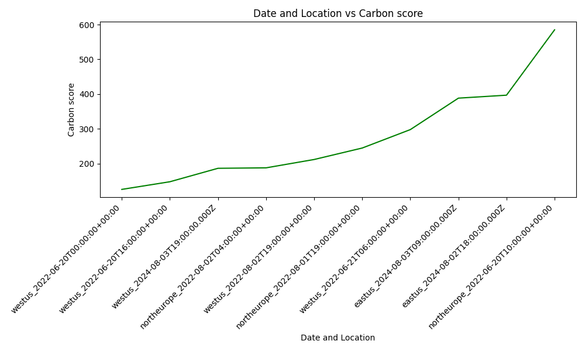

# Plotter Model

## Overview
The Plotter model created for the Impact Engine Framework is designed to visualize data through various types of graphs such as bar, line, and scatter plots. It takes input in YAML format or csv format , defining the x and y values along with additional parameters to customize the plots.

## Type 1 : Read from Impl file

## Usage
This model is typically used in a pipeline following data-enrichment models like `carbon-advisor`, which populates the `plotted_points` parameter required by Plotter. If the user prefers he can specify the `plotted_points` parameter himself in the Impl file but the main value of the model is its ability to visualize the data provided by other models of the Impact Engine Framework.

## Configuration
Required parameters include:
- `plotted_values`: The data points to plot, enriched by preceding models in the pipeline.
- `x_name`: Array of one or more attributes from `plotted_values` to form the 'x-axis'.
- `y_name`: A single attribute from `plotted_values` for the 'y_axis'.

Optional parameters with defaults:
- `colour`: Default is `light-blue`.
- `diagram_name`: Defaults to `combinations_diagram.png`.
- `x_axis_name`, `y_axis_name`: Axis labels, auto-generated if not provided. Default 'x_axis_name' is the 'x_name' attributes concatenated with underscore. Default 'y_axis_name' is the 'y_name' attribute.
- `diagram_title`: Auto-generated if not provided. Default diagram_title is  'x_axis_name' vs 'y_axis_name'.
- `graph_type`: Can be `bar`, `line`, or `scatter`. Default is `bar`.

## Simple Example Impl and corresponding Ompl
Impl:
```yaml
name: Plotter_demo
description: example impl invoking plotter model
tags: null
initialize:
  plugins:
    plotter:
      method: Visualizer
      path: "@grnsft/if-optimisation-models"
tree:
  children:
    child0:
      defaults:
        command: 'python3 ./src/lib/visualizer/plotter'
        x_name: ['time']
        y_name: energy
        colour: blue
        diagram_name: New_diagram
        x_axis_name: Time in hours minutes and second
        y_axis_name: Energy in KWh
        diagram_title: time and Energy comparison
        graph_type: bar  
      pipeline:
        - plotter
      inputs:
        - plotted_points:
            - time: 12:00:34
              energy: 5
            - time: 13:01:56
              energy: 3
            - time: 14:20:22
              energy: 8 
```
Ompl:
```yaml
name: Plotter_demo
description: example impl invoking plotter model
tags: null
initialize:
  plugins:
    plotter:
      path: '@grnsft/if-optimisation-models'
      method: Visualizer
tree:
  children:
    child0:
      defaults:
        command: python3 ./src/lib/plotter/plotter
        x_name:
          - time
        y_name: energy
        colour: blue
        diagram_name: New_diagram
        x_axis_name: Time in hours minutes and second
        y_axis_name: Energy in KWh
        diagram_title: time and Energy comparison
        graph_type: bar
      pipeline:
        - plotter
      inputs:
        - plotted_points:
            - time: '12:00:34'
              energy: 5
            - time: '13:01:56'
              energy: 3
            - time: '14:20:22'
              energy: 8
      outputs:
        - command: python3 ./src/lib/plotter/plotter
          x_name:
            - time
          y_name: energy
          colour: blue
          diagram_name: New_diagram
          x_axis_name: Time in hours minutes and second
          y_axis_name: Energy in KWh
          diagram_title: time and Energy comparison
          graph_type: bar
          plotted_points:
            - time: '12:00:34'
              energy: 5
            - time: '13:01:56'
              energy: 3
            - time: '14:20:22'
              energy: 8
          diagram: /home/user/repo/Code/if-optimisation-models/New_diagram.png

```
And we can see the following diagram being created:


## Example Pipeline with carbon-advisor for plotted points
Impl:
```yaml
name: Carbon Advisor Demo with plotter
description: Simple demo for invoking carbon-advisor model and the plotter
tags: null
initialize:
  plugins:
    carbon-aware-advisor:
      method: CarbonAwareAdvisor
      path: "@grnsft/if-optimisation-models"
    plotter:
      method: Shell
      path: "@grnsft/if-models"
tree:
  children:
    child0:
      pipeline:
        - carbon-aware-advisor
        - plotter
      defaults:
        allowed-locations:  ['northeurope','eastus','westus']
        allowed-timeframes: [
            "2022-06-19T14:00:00Z - 2022-06-21T19:00:00Z",
            "2022-08-01T19:00:00Z - 2022-08-03T20:35:31Z",
            "2024-08-01T19:00:00Z - 2024-08-03T20:35:31Z"
          ]
        sampling: 10
        command: 'python3 ./src/lib/plotter/plotter'
        x_name:  [location,time]
        y_name: score
        colour: green
        diagram_name: demo
        x_axis_name: Date and Location
        y_axis_name: Carbon score
        diagram_title: Carbon score in relation to time and location (ascending)
        graph_type: line # bar line or scatter
      inputs:
        -  
```
Ompl:
```yaml
name: Carbon Advisor Demo with plotter
description: Simple demo for invoking carbon-advisor model and the plotter
tags: null
initialize:
  plugins:
    carbon-aware-advisor:
      path: '@grnsft/if-optimisation-models'
      method: CarbonAwareAdvisor
    plotter:
      path: '@grnsft/if-models'
      method: Shell
tree:
  children:
    child0:
      pipeline:
        - carbon-aware-advisor
        - plotter
      defaults:
        allowed-locations:
          - northeurope
          - eastus
          - westus
        allowed-timeframes:
          - 2022-06-19T14:00:00Z - 2022-06-21T19:00:00Z
          - 2022-08-01T19:00:00Z - 2022-08-03T20:35:31Z
          - 2024-08-01T19:00:00Z - 2024-08-03T20:35:31Z
        sampling: 10
        command: python3 ./src/lib/plotter/plotter
        x_name:
          - location
          - time
        y_name: score
        colour: green
        diagram_name: demo
        x_axis_name: Date and Location
        y_axis_name: Carbon score
        diagram_title: Carbon score in relation to time and location (ascending)
        graph_type: line
      inputs:
        - null
      outputs:
        - allowed-locations:
            - northeurope
            - eastus
            - westus
          allowed-timeframes:
            - 2022-06-19T14:00:00Z - 2022-06-21T19:00:00Z
            - 2022-08-01T19:00:00Z - 2022-08-03T20:35:31Z
            - 2024-08-01T19:00:00Z - 2024-08-03T20:35:31Z
          sampling: 10
          command: python3 ./src/lib/plotter/plotter
          x_name:
            - location
            - time
          y_name: score
          colour: green
          diagram_name: demo
          x_axis_name: Date and Location
          y_axis_name: Carbon score
          diagram_title: Carbon score in relation to time and location (ascending)
          graph_type: line
          suggestions:
            - suggested-location: westus
              suggested-timeframe: '2022-06-20T00:00:00+00:00'
              suggested-score: 126
          plotted_points:
            - location: westus
              time: '2022-06-20T00:00:00+00:00'
              score: 126
            - location: northeurope
              time: '2022-06-21T11:00:00+00:00'
              score: 569
            - location: eastus
              time: '2022-06-20T05:00:00+00:00'
              score: 393
            - location: northeurope
              time: '2022-06-20T18:00:00+00:00'
              score: 556
            - location: northeurope
              time: '2022-08-02T04:00:00+00:00'
              score: 188
            - location: eastus
              time: '2022-08-02T23:00:00+00:00'
              score: 495
            - location: eastus
              time: '2022-08-03T16:00:00+00:00'
              score: 469
            - location: westus
              time: '2024-08-03T19:00:00.000Z'
              score: 201.16041666666666
            - location: eastus
              time: '2024-08-01T23:00:00.000Z'
              score: 417.175
            - location: westus
              time: '2024-08-02T03:00:00.000Z'
              score: 272.66041666666666
          diagram: /home/user/repo/Code/if-optimisation-models/demo.png

```
And we can see the following diagram being created:

## Running
The model reads YAML input from stdin and outputs a graph image along with updated YAML data to stdout or to the ompl file. Ensure the preceding model in the pipeline enriches the input with `plotted_values` or the user must insert them directly to the Impl file. The diagram parameter in the Ompl file shows ehere the created diagram has been saved on your local computer.


## Type 2 : Read from csv file

## Usage
This model can also be used to plot data currently stored in csv file format. The user is rewuired to specify the `y_value` parameter in the Impl file which will be the row of the csv to plot.

## Configuration
Required parameters include:
- `csv_path`: The csv file to read from. Give relative path compared to Code/if-optimisation-models directory.
- `y_name`: One attributes  which will be the first element of a row in the csv. This row will then be plotted.\

Optional parameters with defaults:
- `colour`: Default is `light-blue`.
- `diagram_name`: Defaults to `combinations_diagram.png`.
- `x_axis_name`, `y_axis_name`: Axis labels, auto-generated if not provided. Default 'x_axis_name' is Carbon Date or Type. Default 'y_axis_name' is the 'y_name' attribute.
- `diagram_title`: Auto-generated if not provided. Default diagram_title is  'x_axis_name' vs 'y_axis_name'.
- `graph_type`: Can be `bar`, `line`, or `scatter`. Default is `bar`.

## Simple Example Impl and corresponding Ompl
Impl:
```yaml
name: plotter-demo2
description: example impl invoking Plotter model
tags: null
initialize:
  plugins:
    plotter:
      method: Shell
      path: "@grnsft/if-models"
tree:
  children:
    child0:
      defaults:
        command: 'python3 ./src/lib/plotter/plotter'
        y_name: graph.carbon
        colour: red
        diagram_name: Test_diagram2
        x_axis_name: Date
        y_axis_name: Carbon
        diagram_title: Carbon Emission per Date for graph.carbon
        graph_type: scatter   
        csv_path: 'helper2.csv'
      pipeline:
        - plotter
      inputs: 
      -
```
Ompl:
```yaml
name: plotter-demo2
description: example impl invoking Plotter model
tags: null
initialize:
  plugins:
    plotter:
      path: '@grnsft/if-models'
      method: Shell
tree:
  children:
    child0:
      defaults:
        command: python3 ./src/lib/plotter/plotter
        y_name: graph.carbon
        colour: red
        diagram_name: Test_diagram2
        x_axis_name: Date
        y_axis_name: Carbon
        diagram_title: Carbon Emission per Date for graph.carbon
        graph_type: scatter
        csv_path: helper2.csv
      pipeline:
        - plotter
      inputs:
        - null
      outputs:
        - command: python3 ./src/lib/plotter/plotter
          y_name: graph.carbon
          colour: red
          diagram_name: Test_diagram2
          x_axis_name: Date
          y_axis_name: Carbon
          diagram_title: Carbon Emission per Date for graph.carbon
          graph_type: scatter
          csv_path: helper2.csv
          diagram: /home/user/repo/Code/if-optimisation-models/Test_diagram2.png

```
And we can see the following diagram being created:


## Running
The model reads YAML input  from stdin and opens the csv file specified . In the ennd it outputs a graph image along with updated YAML data to stdout or to the ompl file. Ensure that the csv file exists and is in the correct path. Also make sure that the 'y_name value' is a value in the first column of the csv. The diagram parameter in the Ompl file shows ehere the created diagram has been saved on your local computer.


## Dependencies
- `matplotlib`
- `PyYAML`
- `Pandas`

Ensure these Python libraries are installed in your environment to use the Plotter model.

## Contributing
Contributions to enhance the Plotter model, such as adding more graph types or improving the input/output handling, are welcome. Please submit pull requests with your proposed changes.