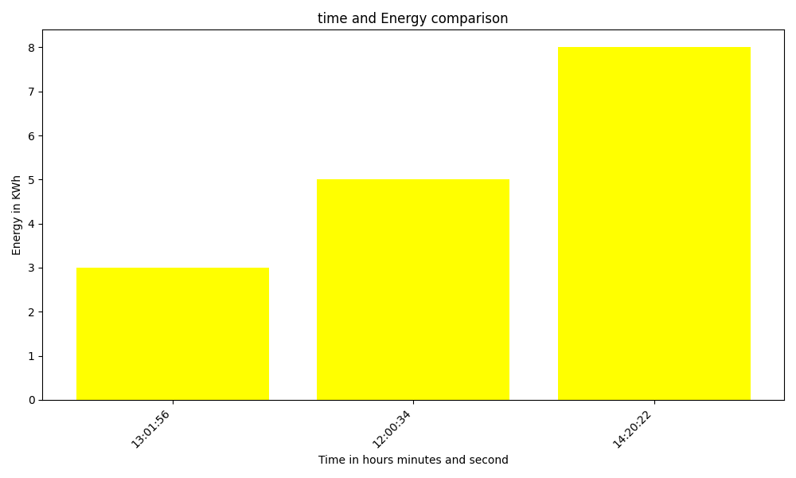
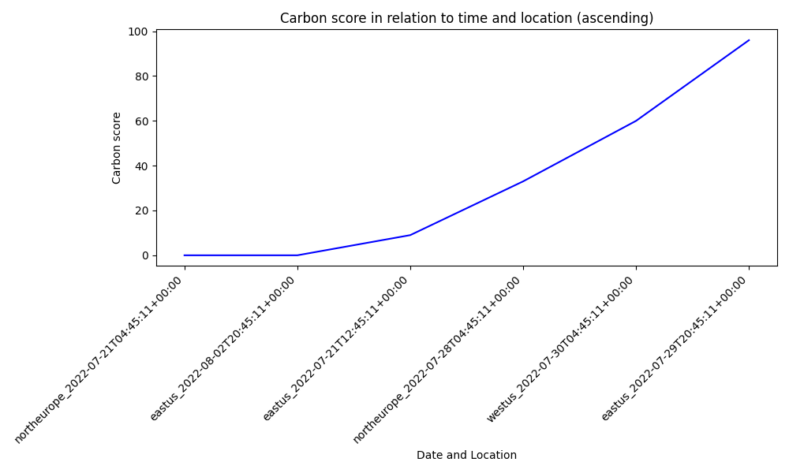

# Plotter Model

## Overview
The Plotter model created for the Impact Engine Framework is designed to visualize data through various types of graphs such as bar, line, and scatter plots. It takes input in YAML format, defining the x and y values along with additional parameters to customize the plots.

## Usage
This model is typically used in a pipeline following data-enrichment models like `carbon-advisor`, which populates the `plotted_points` parameter required by Plotter. If the user prefers he can specify the `plotted_points` parameter himself in the Impl file but the main value of the model is its ability to visualize the data provided by other models of the Impact Engine Framework.

## Configuration
Required parameters include:
- `plotted_values`: The data points to plot, enriched by preceding models in the pipeline.
- `x_name`: Array of one or more attributes from `plotted_values` to form the 'x-axis'.
- `y_name`: A single attribute from `plotted_values` for the 'y_axis'.

Optional parameters with defaults:
- `colour`: Default is `light-blue`.
- `diagram_name`: Defaults to `combinations_diagram.png`.
- `x_axis_name`, `y_axis_name`: Axis labels, auto-generated if not provided. Default 'x_axis_name' is the 'x_name' attributes concatenated with underscore. Default 'y_axis_name' is the 'y_name' attribute.
- `diagram_title`: Auto-generated if not provided. Default diagram_title is  'x_axis_name' vs 'y_axis_name'.
- `graph_type`: Can be `bar`, `line`, or `scatter`. Default is `bar`.

## Simple Example Impl and corresponding Ompl
Impl:
```yaml
name: plotter -demo
description: example impl invoking plotter model
tags:
initialize:
  models:
    - name: plotter
      model: ShellModel
      path: '@grnsft/if-models'
graph:
  children:
    child:
      pipeline:
        - plotter
      config:
        plotter:
          command: 'python3 ./src/lib/visualizer/plotter'
          x_name: ['time']
          y_name: energy
          colour: yellow
          diagram_name: New_diagram
          x_axis_name: Time in hours minutes and second
          y_axis_name: Energy in KWh
          diagram_title: time and Energy comparison
          graph_type: bar        
      inputs:
        - plotted_points:
            - time: 12:00:34
              energy: 5
            - time: 13:01:56
              energy: 3
            - time: 14:20:22
              energy: 8 
```
Ompl:
```yaml
name: plotter -demo
description: example impl invoking plotter model
tags: null
initialize:
  models:
    - name: plotter
      path: '@grnsft/if-models'
      model: ShellModel
graph:
  children:
    child:
      pipeline:
        - plotter
      config:
        plotter:
          command: python3 ./src/lib/visualizer/plotter
          x_name:
            - time
          y_name: energy
          colour: yellow
          diagram_name: New_diagram
          x_axis_name: Time in hours minutes and second
          y_axis_name: Energy in KWh
          diagram_title: time and Energy comparison
          graph_type: bar
      inputs:
        - plotted_points:
            - time: '12:00:34'
              energy: 5
            - time: '13:01:56'
              energy: 3
            - time: '14:20:22'
              energy: 8
      outputs:
        - plotted_points:
            - time: '12:00:34'
              energy: 5
            - time: '13:01:56'
              energy: 3
            - time: '14:20:22'
              energy: 8
          command: python3 ./src/lib/visualizer/plotter
          x_name:
            - time
          y_name: energy
          colour: yellow
          diagram_name: New_diagram
          x_axis_name: Time in hours minutes and second
          y_axis_name: Energy in KWh
          diagram_title: time and Energy comparison
          graph_type: bar
          diagram: /home/jim/comp0101-ief/Code/if-optimisation-models/New_diagram.png

```
And we can see the following diagram being created:


## Example Pipeline with carbon-advisor for plotted points
Impl:
```yaml
name: plot-demo
description: example impl invoking carbon advisor and Plotter model
tags:
initialize:
  models:
    - name: carbon-advisor
      model: CarbonAwareAdvisor
      path: "@grnsft/if-optimisation-models"
    - name: plotter
      model: ShellModel
      path: "@grnsft/if-models"
graph:
  children:
    child:
      pipeline:
        - carbon-advisor
        - plotter
      config:
        carbon-advisor:
          allowed-locations:  ['northeurope','eastus','westus']
          allowed-timeframes: [
            "2022-07-19T14:00:00Z - 2022-07-31T19:00:00Z",
            "2022-08-01T19:00:00Z - 2022-08-03T20:35:31Z"
          ]
          sampling: 6
        plotter:
          command: 'python3 ./src/lib/visualizer/plotter'
          x_name:  [location,time]
          y_name: score
          colour: blue
          diagram_name: demo
          x_axis_name: Date and Location
          y_axis_name: Carbon score
          diagram_title: Carbon score in relation to time and location (ascending)
          graph_type: line # bar line or scatter
      inputs:
        -  
```
Ompl:
```yaml
name: shell-demo
description: example impl invoking shell model
tags: null
initialize:
  models:
    - name: carbon-advisor
      path: '@grnsft/if-optimisation-models'
      model: CarbonAwareAdvisor
    - name: plotter
      path: '@grnsft/if-models'
      model: ShellModel
graph:
  children:
    child:
      pipeline:
        - carbon-advisor
        - plotter
      config:
        carbon-advisor:
          allowed-locations:
            - northeurope
            - eastus
            - westus
          allowed-timeframes:
            - 2022-07-19T14:00:00Z - 2022-07-31T19:00:00Z
            - 2022-08-01T19:00:00Z - 2022-08-03T20:35:31Z
          sampling: 6
        plotter:
          command: python3 ./src/lib/visualizer/plotter
          x_name:
            - location
            - time
          y_name: score
          colour: blue
          diagram_name: demo
          x_axis_name: Date and Location
          y_axis_name: Carbon score
          diagram_title: Carbon score in relation to time and location (ascending)
          graph_type: line
      inputs:
        - null
      outputs:
        - allowed-locations:
            - northeurope
            - eastus
            - westus
          allowed-timeframes:
            - 2022-07-19T14:00:00Z - 2022-07-31T19:00:00Z
            - 2022-08-01T19:00:00Z - 2022-08-03T20:35:31Z
          sampling: 6
          command: python3 ./src/lib/visualizer/plotter
          x_name:
            - location
            - time
          y_name: score
          colour: blue
          diagram_name: demo
          x_axis_name: Date and Location
          y_axis_name: Carbon score
          diagram_title: Carbon score in relation to time and location (ascending)
          graph_type: line
          suggestions:
            - suggested-location: northeurope
              suggested-timeframe: '2022-07-21T04:45:11+00:00'
              suggested-score: 0
            - suggested-location: eastus
              suggested-timeframe: '2022-08-02T20:45:11+00:00'
              suggested-score: 0
          plotted_points:
            - location: northeurope
              time: '2022-07-21T04:45:11+00:00'
              score: 0
            - location: eastus
              time: '2022-08-02T20:45:11+00:00'
              score: 0
            - location: westus
              time: '2022-07-30T04:45:11+00:00'
              score: 60
            - location: northeurope
              time: '2022-07-26T20:45:11+00:00'
              score: 81
            - location: eastus
              time: '2022-07-20T12:45:11+00:00'
              score: 73
            - location: northeurope
              time: '2022-07-24T12:45:11+00:00'
              score: 72
          diagram: /home/jim/comp0101-ief/Code/if-optimisation-models/demo.png

```
And we can see the following diagram being created:

## Running
The model reads YAML input from stdin and outputs a graph image along with updated YAML data to stdout or to the ompl file. Ensure the preceding model in the pipeline enriches the input with `plotted_values` or the user must insert them directly to the Impl file. The diagram parameter in the Ompl file shows ehere the created diagram has been saved on your local computer.

## Dependencies
- `matplotlib`
- `PyYAML`

Ensure these Python libraries are installed in your environment to use the Plotter model.

## Contributing
Contributions to enhance the Plotter model, such as adding more graph types or improving the input/output handling, are welcome. Please submit pull requests with your proposed changes.