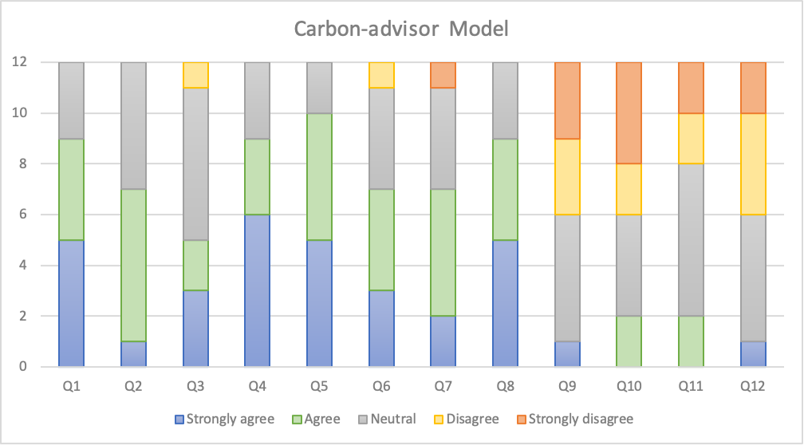
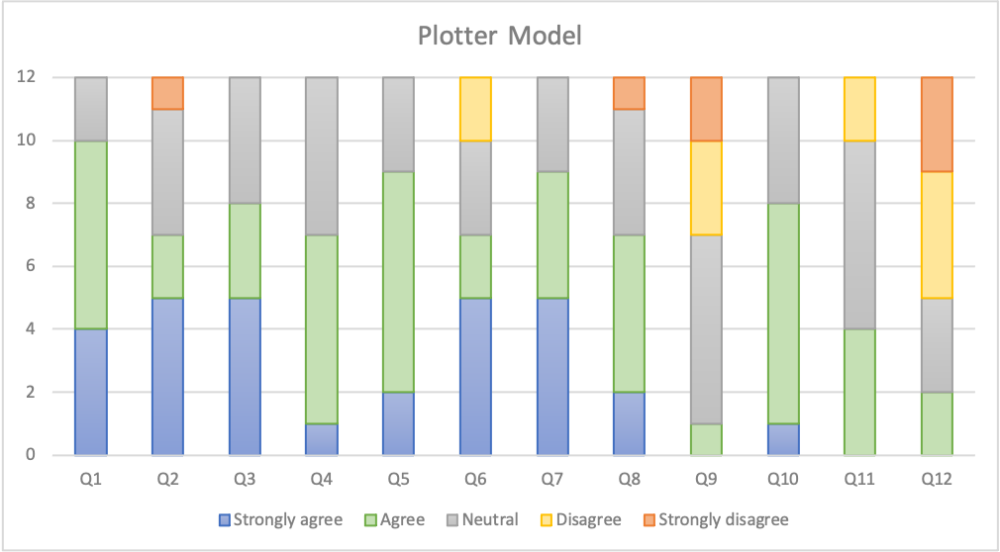
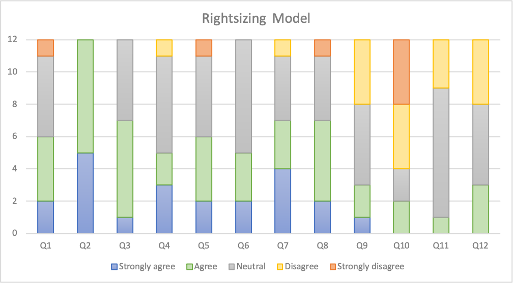

# Usability testing

We conducted usability testing utilizing the questionnaire available [here](https://forms.office.com/e/f6Zjcfu6Db). Participants were asked to evaluate the usability of each model and offer suggestions for enhancement. Due to the requirement for model installation and execution, we encountered limitations in participant recruitment, resulting in a sample size of 12 individuals.

### Questions

These 13 questions are applicable to each model:

1. I found the functionality of this model aligns well with my requirements.
2. I think that I would like to use this model frequently.
3. I found the various functions in this model to be well-integrated.
4. I think this model integrates well with other official or unofficial models of the Impact Framework.
5. I believe the response time of this model meets my expectations for efficient usage.
6. I feel confident in the reliability and accuracy of the outputs generated by this model.
7. The model provides valuable and relevant insights that contribute to informed decision-making.
8. I found the documentation for this model to be excellent. Following the instructions provided makes it easy to get started.
9. I thought there were too many inconsistencies in this system.
10. I found the model unnecessarily complex.
11. I needed to learn a lot of things before I could get started with this model.
12. I think that I would need the support of a technical person to be able to use this system.
13. Any other relevant suggestions?

## Result

|     | Strongly agree | Agree | Neutral | Disagree | Strongly disagree |
| --- | -------------- | ----- | ------- | -------- | ----------------- |
| Q1  | 5              | 4     | 3       | 0        | 0                 |
| Q2  | 1              | 6     | 5       | 0        | 0                 |
| Q3  | 3              | 2     | 6       | 1        | 0                 |
| Q4  | 6              | 3     | 3       | 0        | 0                 |
| Q5  | 5              | 5     | 2       | 0        | 0                 |
| Q6  | 3              | 4     | 4       | 1        | 0                 |
| Q7  | 2              | 5     | 4       | 0        | 1                 |
| Q8  | 5              | 4     | 3       | 0        | 0                 |
| Q9  | 1              | 0     | 5       | 3        | 3                 |
| Q10 | 0              | 2     | 4       | 2        | 3                 |
| Q11 | 0              | 2     | 6       | 2        | 2                 |
| Q12 | 1              | 0     | 5       | 4        | 2                 |

**Table 1:** Carbon-advisor Model Usability Responses

|     | Strongly agree | Agree | Neutral | Disagree | Strongly disagree |
| --- | -------------- | ----- | ------- | -------- | ----------------- |
| Q1  | 4              | 6     | 2       | 0        | 0                 |
| Q2  | 5              | 2     | 4       | 0        | 1                 |
| Q3  | 5              | 3     | 4       | 0        | 0                 |
| Q4  | 1              | 6     | 5       | 0        | 0                 |
| Q5  | 2              | 7     | 3       | 0        | 0                 |
| Q6  | 5              | 2     | 3       | 2        | 0                 |
| Q7  | 5              | 4     | 3       | 0        | 0                 |
| Q8  | 2              | 5     | 4       | 0        | 1                 |
| Q9  | 0              | 1     | 6       | 3        | 2                 |
| Q10 | 1              | 7     | 4       | 0        | 0                 |
| Q11 | 0              | 4     | 6       | 2        | 0                 |
| Q12 | 0              | 2     | 3       | 4        | 3                 |

**Table 2:** Plotter Model Usability Responses

|     | Strongly agree | Agree | Neutral | Disagree | Strongly disagree |
| --- | -------------- | ----- | ------- | -------- | ----------------- |
| Q1  | 2              | 4     | 5       | 0        | 1                 |
| Q2  | 5              | 7     | 0       | 0        | 0                 |
| Q3  | 1              | 6     | 5       | 0        | 0                 |
| Q4  | 3              | 2     | 6       | 1        | 0                 |
| Q5  | 2              | 4     | 5       | 0        | 1                 |
| Q6  | 2              | 3     | 7       | 0        | 0                 |
| Q7  | 4              | 3     | 4       | 1        | 0                 |
| Q8  | 2              | 5     | 4       | 0        | 1                 |
| Q9  | 1              | 2     | 5       | 4        | 0                 |
| Q10 | 0              | 2     | 2       | 4        | 4                 |
| Q11 | 0              | 1     | 8       | 3        | 0                 |
| Q12 | 0              | 3     | 5       | 4        | 0                 |

**Table 3:** Rightsizing Model Usability Responses

**Figure 1:** Usability testing result of Carbon-advisor.

**Figure 2:** Usability testing result of Plotter.

**Figure 1:** Usability testing result of Rightsizing.

## Improvement

According to the suggestions from the questionnaire, we found that the majority of usability challenges encountered with our models were not exclusive to our products but rather stemmed from the design of the impact engine itself.  They were relative to the lack of a graphical interface and the difficulty to write and read the manifest files. Unfortunately, these issues are inherent to the design of the impact engine and require modifications at a higher level, beyond the scope of our models.

On the other hand, we identified several specific issues relevant only to our three models. We successfully addressed these issues by introducing new features.

- Carbon aware advisor:
    - Problem:
        - It was tedious to include all available locations in the `Impl` file and some times some were missed.
    - Solutions:
        - We created useful keywords such as `europe`, `south america`, `world` etc to represent group of locations.
- Plotter:
    - Problem:
        - It was difficult for the user who just required a quick visualization of the data to fill in the `Impl` file the numerous parameters needed.
    - Solutions:
        - We made most of them optional and added default values.
- Right sizing:
    - Problem:
        - When dealing with multiple instances of the same type, it was difficult in the `Ompl` file to understand which of the new instances replaced which of the old.
    - Solutions:
        - We added the concept of `instance id` as a parameter.